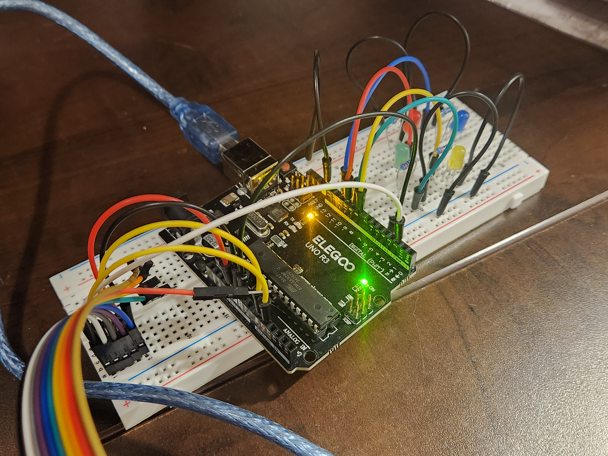

# Simon Says
Arduino-based Simon Says memory game. Generates and displays a random sequence of LEDs, adding one LED at a time, and prompts the user to copy the inputs. If the player makes a mistake, the game ends and the player’s final score is printed.

## Project Info
- **Type:** Personal Embedded Systems Project
- **Technologies:** Arduino, C++
- **Date:** July 2025

## Demo Video
_Click the image below_

## Hardware Setup

- Arduino (Uno)
- 4 LEDs
- Joystick module
- 4 220 Ω resistors
- Breadboard and jumper wires

The joystick is used to select and confirm inputs corresponding to each LED direction.

## Game Logic

1. The game initializes a random sequence using Arduino's pseudo-random number generator.
2. Each round appends one additional LED to the sequence.
3. The sequence is displayed to the player with timed LED signals.
4. The player reproduces the sequence by moving the joystick to the corresponding direction (up, down, left, right)
5. Inputs are validated step-by-step; the game ends immediately upon incorrect input.
6. The final score is output via serial communication.

## Technical Highlights

- Implemented modular game logic to separate input handling, LED control, and game state
- Used clean, readable C++ functions to support debugging and iteration
- Designed the system to handle timing constraints and user input edge cases
- Focused on maintainability and debuggability in an embedded environment

## Other files 
[Source code](simon_says.ino) : Main Arduino sketch containing game logic, input handling, and LED control  
[Hardware setup](simon_says_2.jpg) : Image showing the hardware setup and wiring
